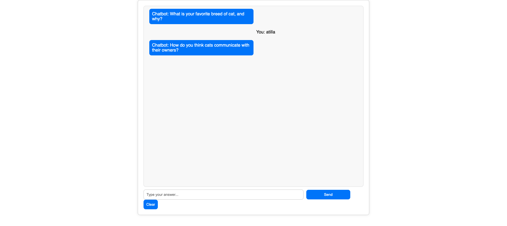

Chat App Frontend Case Study

## Table of Contents

- [Overview](#overview)
  - [Features](#features)
- [Project Structure](#project-structure)
- [Setup and Running](#setup-and-running)
- [Contact](#contact)

## Overview



This is the frontend for a simple chatbot application that interacts with users by asking a series of questions and storing their responses. The frontend is built using ReactJS and relies on Socket.IO to communicate with the backend for real-time message transmission.


## Features
The chatbot asks the user 10 predefined questions one by one.
User responses are sent in real-time to the backend via a WebSocket connection (Socket.IO).
The chat history is displayed in the chat window, distinguishing between bot messages and user responses.
Ability to clear the chat history.
Gracefully handles socket disconnection and reconnection.
**Tech Stack**
ReactJS: Frontend library for building the user interface.
Socket.IO: For real-time communication with the backend.
CSS: Basic styling for the chat interface.

## Project Structure
```
├── public/
│   ├── index.html
├── src/
│   ├── utils/
│   │   └── helper.ts      # Utility function to get sessionId
│   ├── types/
│   │   └── ChatHistory.ts # Type definition for chat history
│   ├── App.tsx            # Main React component
│   ├── index.tsx          # Entry point for rendering the app
│   └── styles.css         # Styling for the chat interface
├── package.json
└── README.md

```
## Setup and Running

Follow these steps to get the project up and running on your local machine.

Clone the Project and Install Dependencies
Start the Development Server

```bash
$  git clone github.com/AtillaTahak/chat-app-frontend
$  cd chat-app-frontend
$  npm install
$  npm run dev
```

The chatbot UI will be available at http://localhost:3000.

Note: Ensure that your backend (NestJS server) is running on http://localhost:3002 for the frontend to correctly establish the WebSocket connection.

## Workflow in This Project

**Key Files**
- App.tsx – This file contains the logic for handling WebSocket connections, managing the message flow, and rendering the chat interface.
- styles.css – Basic CSS for styling the chatbot and user input.
- helper.ts – Utility function to generate/manage a session identifier for tracking user sessions.
- ChatHistory.ts – Type definitions for handling the chat history format.
**WebSocket Communication**
- The client communicates with the backend using Socket.IO.
When the client connects, it sends the sessionId to register the user session.
- newQuestion: The frontend listens for new questions from the backend.
- userAnswer: User responses are sent to the backend with the session ID for storage.
- clearHistory: Emits an event to clear the user's chat history.
**Event Listeners**
connect: Emitted when the client successfully connects to the Socket.IO server.
newQuestion: The client listens for questions sent by the chatbot.
chatHistory: Fetches previous chat history and displays it to the user.


## Contact

- GitHub: [@AtillaTahak](https://github.com/AtillaTahak)
- Twitter: [@AtillaTahaa](https://twitter.com/AtillaTahaa)
- LinkedIn: [LinkedIn](https://www.linkedin.com/in/atillatahakordugum)
- Blog: [Blog](https://atillataha.blogspot.com)
- Youtube: [YouTube](https://www.youtube.com/channel/UCmoD0x4Z9vdG2PCsI5p8FYg)
- Portfolio: [Portfolio](atillataha.netlify.app)
